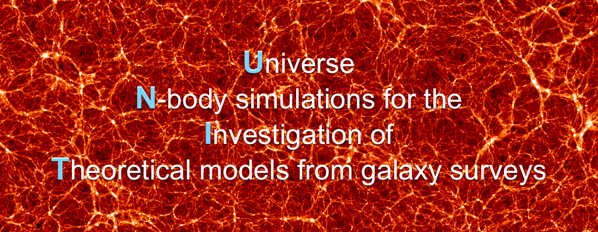

# UNITsims on NERSC

Website: http://www.unitsims.org

Main paper: https://ui.adsabs.harvard.edu/abs/2019MNRAS.487...48C/abstract

Contacts: Chia-Hsun Chuang (chuangch@stanford.edu), Gustavo Yepes (gustavo.yepes@uam.es)

#### [Locations on NERSC HPSS](https://github.com/chuang-cosmology/UNITsims/blob/main/README.md#locations-on-hpss-ie-tape)
* [Full particle snapshots](https://github.com/chuang-cosmology/UNITsims#full-particle-snapshots)
* [Density field](https://github.com/chuang-cosmology/UNITsims#density-field-2-pairs-of-1gpch-high-resolution-boxes-with-128-redshifts-available)
* [0.5% of particles](https://github.com/chuang-cosmology/UNITsims#05-of-particles-2-pairs-of-1gpch-high-resolution-boxes-with-128-redshifts-available)
* [Initial conditions](https://github.com/chuang-cosmology/UNITsims#initial-conditions)
* [Halo catalogues](https://github.com/chuang-cosmology/UNITsims#halo-catalogues)
#### [How to access the files](https://github.com/chuang-cosmology/UNITsims#access-the-files)
#### [How to read the files](https://github.com/chuang-cosmology/UNITsims#read-the-files) -- under construction

## Locations on NERSC HPSS (i.e. tape)

### Full particle snapshots
#### 1Gpc/h (high resolution boxes; 1st pair have 64 redshifts available and 2nd pair have only 8 redshifts)
    /home/c/chuang/UNITSIMS/1Gpc_4096_001/
    /home/c/chuang/UNITSIMS/1Gpc_4096_001_InvPhase/
    /home/c/chuang/UNITSIMS/1Gpc_4096_002/
    /home/c/chuang/UNITSIMS/1Gpc_4096_002_InvPhase/
    
#### 1Gpc/h (low resolution box; one box)
    /home/c/chuang/UNITSIMS/1Gpc_2048_001/

#### 2Gpc/h (low resolution box; 1 pair)
    /home/c/chuang/UNITSIMS/2Gpc_4096_001/
    /home/c/chuang/UNITSIMS/2Gpc_4096_001_InvPhase/

#### 3Gpc/h (low resolution boxes; 1 pair)
    /home/c/chuang/UNITSIMS/3Gpc_6144_001/

### Density field (2 pairs of 1Gpc/h high resolution boxes with 128 redshifts available)
    /home/c/chuang/UNITSIMS/DM_density_and_particle/density_and_particle/1Gpc_4096/fixedAmp_001/DM_DENS/
    /home/c/chuang/UNITSIMS/DM_density_and_particle/density_and_particle/1Gpc_4096/fixedAmp_001_InvPhase/DM_DENS/
    /home/c/chuang/UNITSIMS/DM_density_and_particle/density_and_particle/1Gpc_4096/fixedAmp_002/DM_DENS/
    /home/c/chuang/UNITSIMS/DM_density_and_particle/density_and_particle/1Gpc_4096/fixedAmp_002_InvPhase/DM_DENS/

### 0.5% of particles (2 pairs of 1Gpc/h high resolution boxes with 128 redshifts available)
    /home/c/chuang/UNITSIMS/DM_density_and_particle/density_and_particle/1Gpc_4096/fixedAmp_001/
    /home/c/chuang/UNITSIMS/DM_density_and_particle/density_and_particle/1Gpc_4096/fixedAmp_001_InvPhase/
    /home/c/chuang/UNITSIMS/DM_density_and_particle/density_and_particle/1Gpc_4096/fixedAmp_002/
    /home/c/chuang/UNITSIMS/DM_density_and_particle/density_and_particle/1Gpc_4096/fixedAmp_002_InvPhase/

### Initial conditions
    /home/c/chuang/UNITSIMS/IC/

### Halo catalogues 
#### Rockstar halos with PID
    /home/c/chuang/UNITSIMS/HALO_CATALOGS/Halo_with_PID/
#### trees (and hlist)
    /home/c/chuang/UNITSIMS/HALO_CATALOGS/tree (and hlist)

## Access the files
### Look up the folders/files on HPSS
    $hsi
    $cd /home/c/chuang/UNITSIMS/

### Full particle snapshots (get and extract)
    $cd path_to_your_scratch_folder
    $htar -xv -f /home/c/chuang/UNITSIMS/1Gpc_4096_001/snapdir_064/snapdir_064_1.tar
    $htar -xv -f /home/c/chuang/UNITSIMS/1Gpc_4096_001/snapdir_064/snapdir_064_2.tar
    $htar -xv -f /home/c/chuang/UNITSIMS/1Gpc_4096_001/snapdir_064/snapdir_064_3.tar
    $htar -xv -f /home/c/chuang/UNITSIMS/1Gpc_4096_001/snapdir_064/snapdir_064_4.tar

P.S. 3Gpc box has 6 tar files instead of 4 files

### IC (get and extract)
    $cd path_to_your_scratch_folder
    $htar -xv -f /home/c/chuang/UNITSIMS/IC/1Gpc_4096_001.tar

### Density files (get)
    $cd path_to_your_scratch_folder
    $hsi
    $cd /home/c/chuang/UNITSIMS/DM_density_and_particle/density_and_particle/1Gpc_4096/fixedAmp_001/DM_DENS
    $get dmdens*

### 0.5% files (get)
    $cd path_to_your_scratch_folder
    $hsi
    $cd /home/c/chuang/UNITSIMS/DM_density_and_particle/density_and_particle/1Gpc_4096/fixedAmp_001/DM_PARTICLES
    $get *
#### then, unzip the bz2 files (bzip2 -d filename.bz2)

### Halo catalogs with PID
    $cd path_to_your_scratch_folder
    $hsi
    $cd /home/c/chuang/UNITSIMS/HALO_CATALOGS/Halo_with_PID/1Gpc_2048_001
    $get *
#### then, unzip the bz2 files (bzip2 -d filename.bz2)

## Read the files
under construction
